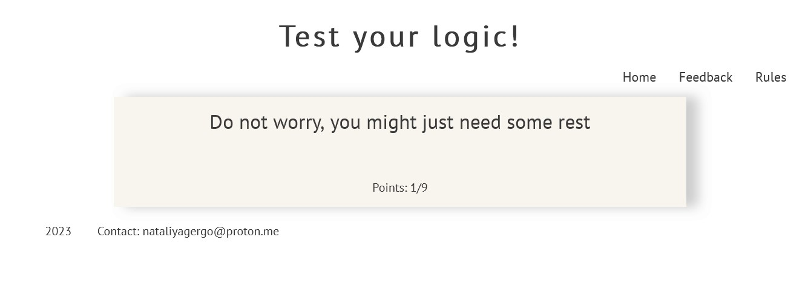
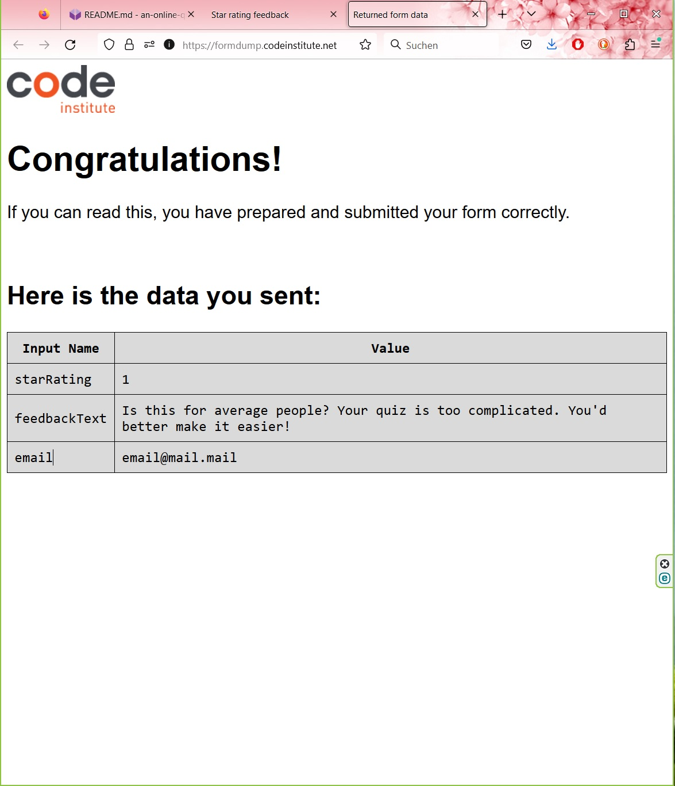

# online-quiz

## overview

This project is a web-based logic quiz designed to test users' logical and reasoning skills. Users can interact with the quiz with a series of logic-based questions, answer questions, view the rules, and provide feedback. Each question has multiple-choice answers. The quiz keeps track of the user's score and displays a result at the end based on the user's score. The user interface is updated as the user progresses through the quiz. 
Furthermore, the last part of the script is for a star-rating feedback system. It listens for click events on each star and updates the visual display of the stars and a hidden input value accordingly. This feedback system allows users to rate the quiz after completing it.

## Features

- Home Page: The home page introduces users to the quiz and allows them to begin testing their logic.
- Rules Page: On the Rules page, users can familiarize themselves with the structure of the quiz, how to answer questions, the scoring system, and the results presentation.
- Feedback Page: The Feedback page provides users with a way to leave star ratings and text feedback about their experience with the quiz.

## Existing Features

- Navigation Bar
  - Featured on all three page and is identical in each page to allow for easy navigation.
  - This section will allow users to easily navigate with all devices without having to revert to the previous page via the "back" button.
- Logic Quiz
  - The core feature of this application is a logic quiz. It is designed with various logical questions that test the user's ability to deduce and infer from the given information.
- Multiple Choice Questions
  - Each question in the quiz is a multiple-choice question. Users can choose one of the given options as their answer.
- Automated Scoring
  - The application calculates the user's score automatically. Points are awarded for each correct answer and added to the user's total score.
- Dynamic Quiz Progression
  - As the user goes through the quiz, the user interface updates dynamically. The current question and multiple-choice options are displayed, and the question count is updated.
- Answer Validation
  - Once a user selects an answer, the app validates the answer. If the answer is correct, it is highlighted in green, and if the answer is incorrect, it is highlighted in red. The correct answer is also revealed if the user gets the question wrong. 
- End-of-Quiz Results
  - At the end of the quiz, a result is displayed based on the user's total score. There are different results depending on the range in which the user's score falls.
- Interactive Star Rating Feedback System 
  - After completing the quiz, users can provide feedback by giving a star rating. The rating system is interactive, with the stars changing color when clicked. The submitting page opens in a new window. 
- Responsive Design
  - The quiz application is designed to work seamlessly across different device sizes and orientations, making it accessible to users on desktops, tablets, and smartphones.
- Clean, User-Friendly Interface
  - The application boasts a clean, intuitive interface that makes it easy for users to navigate through the quiz and understand how to interact with the application.

## UX

- Easy to Start
  - As soon as a user arrives at the application, they are greeted with the first question of the quiz, along with multiple-choice options. There's no need to navigate through menus or click a 'start' button, which provides a seamless start to the experience.
- Clear Feedback
  - After selecting an answer, users are immediately provided with feedback. Correct answers are highlighted in green and incorrect answers in red, making it clear whether they answered correctly or not. This instant feedback helps users learn from any mistakes and enhances the learning experience.
- Progress Tracking
  - Users are kept informed of their progress throughout the quiz. A counter displays the current question number and the total number of questions, letting users know how far they have progressed and how many questions remain.
- Result Explanation
  - At the end of the quiz, users are provided with a result based on their score. This result includes a brief explanation, providing users with a satisfying conclusion to the quiz and a sense of achievement.
- Interactive Rating System
  - After completing the quiz, users are invited to rate their experience. They can do this by clicking on the star icons, which change color upon selection, providing visual feedback and a satisfying, interactive experience.
- Responsive Design
  - Whether users are accessing the quiz on a desktop, tablet, or smartphone, the application adapts to their device. The responsive design ensures that users have a positive experience, regardless of the device they are using.
- Clean, Intuitive Interface
  - The application features a clean, minimalistic design, free of distractions. The user interface is intuitive, with a clear layout and easy-to-read text, making it accessible to users of all ages and technical abilities.

### Site goals

The main goal of our Quiz App is to provide an interactive, engaging, and fun platform where users can challenge their logical thinking and general knowledge. We believe that learning can be exciting, and with our Quiz App, users can enhance their skills while also having a fun and enjoyable experience.

This application is designed with the intention to cater to a wide range of audiences, from students seeking a study break, to adults who wish to enjoy a brief respite from their daily routines, or those who simply enjoy testing their knowledge on a variety of topics.

Additionally, the Quiz App encourages repeat visits with its robust array of questions and intuitive interface, thereby enhancing user engagement. The scoring system and result feedback provide a competitive edge, prompting users to strive for improvement.

The intuitive star rating system for user feedback also helps us understand user experience, making it a useful tool to continuously improve and update the application, ensuring that it consistently meets and exceeds user expectations.

## Testing

- The site was tested in Mozilla-Firefox, Microsoft-Edge and Google-Chrome, on different screensizes and devices. Reduced and increased, no problems seen.
- HTML

  - [official W3C validator](https://validator.w3.org/) one error was found , 'A charset attribute on a meta element found after the first 1024 bytes. At line 650, column 21 charset="utf-8"><link rel="ic..."' which research showed was not a problem with my code.

- CSS
  - No errors were found when passing through the [official Jigsaw validator](http://jigsaw.w3.org/css-validator/validator?lang=de&profile=css3svg&uri=https%3A%2F%2F8000-1101712-lucid-dreaming-o-ubdmkv1q76.us2.codeanyapp.com%2F&usermedium=all&vextwarning=&warning=1)
- JavaScript
  - No errors were found when passing through the [official JavaScript validator](https://jshint.com/). There was one warning on line 248 which may lead to confusing semantics.

* Accessibility
  - I confirmed that the colors and fonts chosen are easy to read and accessible by running it through lighthouse in devtools
    

## Manual testing

Manual testing of all links and necessary features was done in previously mentioned browsers and devices with a positive result. All pages linked correctly, all features worked correctly, feedback submits in new window.
|Feature |Expect |Action |Result |
|:--------- |:---------------|:---------------|:----------------|
|Home navigation |When clicked the home page will open |Clicked Home on the Nav bar|Home page opened when clicked|

## Manual testing of user stories

### Expectation:

A visitor should understand the main purpose of the site.

### Result:

As a visitor, I understand that this is a website to help me to learn about lucid dreaming.

### Expectation:

A visitor needs easy intuitive navigation around the site.

### Result

As a visitor I can easy understand the navigation.

### Expectation

A visitor expects .

### Result:

As a visitor I .

### Expectation

A visitor wants.

### Result

As a visitor I .

### Expectation

A visitor needs .

### Result

As a visitor I .

### Unfixed Bugs

by testing by [official W3C validator](https://validator.w3.org/) one error was found, 'A charset attribute on a meta element found after the first 1024 bytes. At line 650, column 21 charset="utf-8"><link rel="ic..."' which research showed was not a problem with my code.

## Deployment

The project was deployed to GitHub Pages using the following steps:

1. Log in to GitHub and locate the GitHub Repository;
2. At the top of the Repository itself, locate the "Setting" button on the menu;
3. In the Settings page choose the "GitHub Pages" Section;
4. In the "GitHub Pages", under "Source", click the dropdown called "None" and select the "Master
   Branch". The page should refresh automatically;
5. Scroll down the page to locate the now published site link in the "GitHub Pages" section.

## Credits

### Content

- The text for the Home page .
- The rest of the text was composed by me and is my intellectual property.
- The idea how to ... was taken from [w3docs](3https://www.w3docs.com/snippets/html/how-to-create-an-html-button-that-acts-like-a-link.html)
- The instruction how to was taken from 
- The instruction how to creat README file was taken from CodeInstitute Educational materials. [CodeInstituteREADME template](https://github.com/Code-Institute-Solutions/readme-template), Codeinstitute README presentation and [markdownlivepreview](https://markdownlivepreview.com/).
- This reference list would not be complete without mentioning the beginner resourses for front-end at
  [W3Schools](https://w3schools.com)
- And extensive notes and tips hosted at the [Mozilla Foundation]
  (developer.mozilla.org), the home of the worlds' best web browser Firefox.
- And, of course, a thanks goes
  to the friendly part of the [StackOverFlow](https://stackoverflow.com), for helping to pinpoint and fix the
  little bugs and features in my code.

### Media

1. Unless stated otherwise, the image for Lucid-Dreaming page I have AI-generated for non-profit use (education/student projects)
   via the [MidJourney](https://www.midjourney.com) neural network;
2. The other images including Home page Hero image are licenced for non-profit use (education/student projects) via [DreamsTime](https://www.dreamstime.com/).

### Languages used

- [HTML5](https://de.wikipedia.org/wiki/HTML5)
- [CSS3](https://www.w3.org/Style/CSS/)

### Frameworks, Libraries & Programs used

1. [Google Fonts](https://fonts.google.com/specimen/PT+Sans)

- The "Google fonts" tool was used to impoirt the fonts into the style.css file, which is used in this project.

2. [PT Font Family](https://company.paratype.com/pt-sans-pt-serif)

- The fonts from the PT Family were chosed to make the website futureproof. As already mentioned, I
  plan on adding multilanguage support to this project, and the Paratype fonts are built around non-latin
  characters, such as the Cyrillic alphabet and special charachters used in post-Soviet countries, which
  are very rare to find in fonts produced in the anglophone world. While dealing with an impressive amount
  of letters from different language families, the PT font never compromises on aestetics - it has been
  created by the internationally acclaimed typeface designer [Alexandra Korolkova](https://en.wikipedia.org/wiki/Alexandra_Korolkova) and Olga Umpelova.
  However, should the project grow big enough to be translated into east-Asian or south-Asian languages,
  new fonts shall be added to support, for example, Japanese or Thai fonts.

## Acknowledgements

- to Kay Welfare for great psyhological support and motivation.
- to my daughter Anna and my partner Stefan to great support, motivation and helping to resolve the technical questions.
